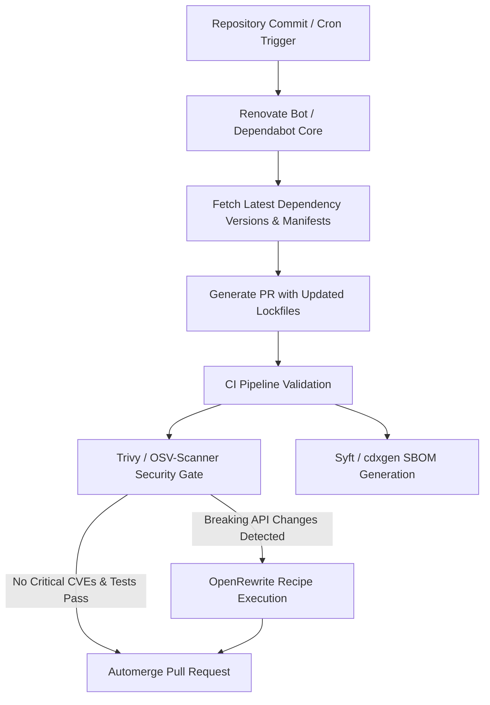

<div align="center">



# 🚀 Awesome Dependency Update Automation 🤖

<p align="center">
  <strong>Curated ecosystem of Autonomous Dependency Update Bots, Software Composition Analysis (SCA), Automated Refactoring Tools, SBOM Generators, and Supply-Chain Security Platforms.</strong>
</p>

<p align="center">
  <a href="https://github.com/ishandutta2007/Awesome-Awesome-Awesome"></a>
  <a href="https://discord.gg/jc4xtF58Ve"></a>
  <a href="https://github.com/ishandutta2007/Awesome-Dependency-Update-Automation/stargazers"></a>
  <a href="https://github.com/ishandutta2007/Awesome-Dependency-Update-Automation/network/members"></a>
  <a href="https://github.com/ishandutta2007/Awesome-Dependency-Update-Automation/issues"></a>
  <a href="https://github.com/ishandutta2007/Awesome-Dependency-Update-Automation/blob/main/LICENSE"></a>
  <a href="https://github.com/ishandutta2007"></a>
</p>

</div>

---

## 🧭 Executive Summary & SEO Keywords

> **Key Focus Areas:** `Dependency Update Automation` • `Automated Pull Requests` • `Software Composition Analysis (SCA)` • `Software Supply Chain Security` • `Automated Code Refactoring` • `Software Bill of Materials (SBOM)` • `Vulnerability Remediation` • `Renovate Bot` • `Dependabot Core` • `Trivy` • `OpenRewrite` • `DevSecOps CI/CD Automation`

Modern software engineering relies on thousands of direct and transitive dependencies. **Awesome Dependency Update Automation** indexes both commercial SaaS platforms and open-source tools designed to discover outdated libraries, resolve lockfiles, detect vulnerable packages, generate SBOMs, and automatically submit merge/pull requests with code migrations.

---

## 📋 Table of Contents

- [☁️ SaaS & Hosted Enterprise Platforms](#️-saas--hosted-enterprise-platforms)
- [💻 Open-Source GitHub Projects (Sorted by Stars)](#-open-source-github-projects-sorted-by-stars)
  - [1. 🛡️ Trivy](#1-️-trivy)
  - [2. 🤖 Renovate](#2--renovate)
  - [3. 🔍 Grype](#3--grype)
  - [4. 🔬 ScanCode Toolkit](#4--scancode-toolkit)
  - [5. 📦 Syft](#5--syft)
  - [6. 🌐 OSV-Scanner](#6--osv-scanner)
  - [7. 🔐 OWASP Dependency-Check](#7--owasp-dependency-check)
  - [8. ⚡ Dependabot Core](#8-️-dependabot-core)
  - [9. 📊 Dependency-Track](#9--dependency-track)
  - [10. 🐘 Gradle Versions Plugin](#10--gradle-versions-plugin)
  - [11. 💎 Bundler-Audit](#11--bundler-audit)
  - [12. 🔄 OpenRewrite](#12--openrewrite)
  - [13. 📑 cdxgen](#13--cdxgen)
  - [14. 🐍 pip-audit](#14--pip-audit)
  - [15. 🦀 cargo-audit / RustSec](#15--cargo-audit--rustsec)
  - [16. 💻 Dependabot CLI](#16--dependabot-cli)
  - [17. ⚙️ Renovate GitHub Action](#17-️-renovate-github-action)
  - [18. 📜 CycloneDX CLI](#18--cyclonedx-cli)
  - [19. 🏛️ Eclipse Steady](#19-️-eclipse-steady)
- [🏗️ Building an Open-Source Dependency Automation Stack](#️-building-an-open-source-dependency-automation-stack)
- [🔍 Commercial SaaS vs Open-Source Comparison](#-commercial-saas-vs-open-source-comparison)
- [🧩 Modern Dependency Update Workflow Architecture](#-modern-dependency-update-workflow-architecture)
- [⭐ Star History](#-star-history)
- [🤝 How to Contribute](#-how-to-contribute)
- [⚠️ Disclaimer](#️-disclaimer)

---

# ☁️ SaaS & Hosted Enterprise Platforms

*Platforms are sorted in descending order by parent company valuation / market capitalization / revenue.*

| Platform / Product | Company Size / Valuation / Revenue | Description | Pricing (Starting Tier) | Free Tier / Free Trial Limits |
|---|---|---|---|---|
| **GitHub Advanced Security (GHAS)** | **Microsoft:** ~$3.1T Market Cap / $245B+ ARR | Native GitHub security suite providing Dependabot alerts & security updates, dependency review, secret scanning, and CodeQL analysis. | **$30/active committer/month** (Code Security) + **$19/active committer/month** (Secret Protection) | **Free forever for public repos:** Unlimited dependency review & secret scanning on public GitHub repos; **30-day free trial** via GitHub Enterprise Cloud. |
| **Dependabot** *(GitHub)* | **Microsoft:** ~$3.1T Market Cap / $245B+ ARR | GitHub-native automated dependency version updates and security pull requests directly in repository workflows. | **Free** ($0, included with all GitHub Free & paid plans) | **Free forever:** Unlimited public & private GitHub repositories (subject to standard GitHub Actions runner limits of 2,000 CI mins/mo on Free accounts). |
| **GitLab Dependency Scanning** *(GitLab Ultimate)* | **GitLab Inc.:** ~$9.0B Market Cap / ~$650M ARR | Integrated GitLab DevSecOps dependency vulnerability and license scanning embedded into CI/CD pipelines and merge request approvals. | Starts at **$99/user/month** (GitLab Ultimate, billed annually at $1,188/user/year) | **30-day free trial:** Full access to GitLab Ultimate features including Dependency Scanning (limited to 400 CI/CD compute minutes/month); free for eligible open-source projects. |
| **Debricked** *(OpenText Core SCA)* | **OpenText:** ~$8.5B Market Cap / ~$5.8B ARR | Open-source dependency analysis and vulnerability management platform offering automated remediation and license compliance. | Starts at **$25/contributing dev/month** ($275/dev billed annually on Premium plan) | **Free forever:** 1,000 initial scan credits + 100 recurring scan credits on the 1st of each month, 500 API calls/hour/contributor, unlimited public repos. |
| **Snyk Open Source** | **Snyk Ltd.:** ~$7.4B Valuation / ~$250M+ ARR | Developer security platform providing open-source dependency scanning, automated vulnerability remediation PRs, license compliance, and SBOM generation. | Starts at **$25/contributing dev/month** (Team plan; Ignite plan at $1,260/dev/year) | **Free forever:** 200–400 Open Source (SCA) tests/month, 100 SAST tests/month, 100 Container tests/month, 300 IaC tests/month, and up to 10,000 monitored projects. |
| **JFrog Xray** | **JFrog Ltd.:** ~$3.5B Market Cap / ~$430M ARR | Software composition analysis and artifact security platform integrated with JFrog Artifactory for deep binary and dependency vulnerability analysis. | Starts at **~$150/month** (JFrog Cloud Pro X tier with Xray enabled) | **14-day free trial:** Full access to JFrog Platform with Xray security scanning (no credit card required; base $0 free platform tier excludes Xray). |
| **Phylum** | **Veracode (Parent):** ~$2.5B Valuation / ~$300M+ ARR | Software supply-chain security platform analyzing open-source dependencies for malicious packages, author reputation anomalies, and software risks. | **$0** (Community) / Teams tier starts at **$54,000/year** (covers up to 100 developers) | **Free forever (Community Edition):** Supports 1 user and up to 5 projects with automated dependency risk and malware analysis. |
| **Black Duck** *(formerly Synopsys SCA)* | **Clearlake / Francisco:** ~$2.1B Valuation / ~$300M+ ARR | Enterprise software composition analysis platform for open-source discovery, deep license compliance, vulnerability tracking, and remediation. | Starts at **~$500/dev/year** (Code Sight IDE) or **~$50,000/year** enterprise base | **30-to-60-day evaluation trial:** Full enterprise POC trial upon sales request; free trial available for Code Sight IDE plugin. |
| **Sonatype Lifecycle** *(Nexus Lifecycle)* | **Vista Equity:** ~$1.5B Valuation / ~$150M+ ARR | Component intelligence and enterprise software composition analysis platform integrated with artifact repositories and CI/CD pipelines. | Starts at **~$775–$900/dev/year** (annual contract, typically 10–25 seat minimum) | **14-to-30-day evaluation trial:** Available upon request/demo; free vulnerability lookups available via Sonatype OSS Index. |
| **Mend SCA & Mend Renovate Enterprise** | **Mend.io:** ~$1.0B+ Valuation / ~$100M+ ARR | Enterprise software composition analysis, centralized Renovate governance, policy automation, and automated remediation. | Starts at **~$250–$500/contributing dev/year** (annual contract per developer) | **14-to-30-day evaluation trial:** POC trial upon sales request (Mend Renovate Community Cloud/Self-hosted is free forever). |
| **Renovate** *(Mend Renovate Community)* | **Mend.io:** ~$1.0B+ Valuation / ~$100M+ ARR | Automated dependency-update platform supporting 90+ package managers, automated PRs, dependency grouping, lockfile maintenance, and scheduling. | **Free** ($0 for Community Cloud & Self-hosted) / Enterprise starts at ~$500/dev/year | **Free forever:** Unlimited public & private repos on GitHub/Bitbucket Cloud, scheduled jobs (e.g. 4-hour cycles on Bitbucket), no custom script execution. |
| **Socket** | **Socket Security:** ~$500M Valuation / $65M+ Raised | Software supply-chain security platform detecting malicious packages, risky install scripts, typosquatting, and compromised maintainer behavior. | Starts at **$25/dev/month** ($300/dev/year, min. 5 devs on Team tier; Business at $50/dev/month) | **Free forever:** 1,000 scans/month, up to 10,000 tracked dependencies, 500 API calls/hour, 3 team members, and 1 repository label (unlimited for public open-source repos). |
| **Endor Labs** | **Endor Labs:** ~$400M Valuation / $93M+ Raised | Dependency and AppSec platform using call-graph reachability analysis to eliminate false positives and govern open-source risks. | Starts at **$10,000/year** (per-contributor annual contract on Core/Pro tiers) | **Free forever (Developer Edition / AURI):** Free CLI/MCP server scanning for individual developers; **30-day free trial** for full team/enterprise platform. |
| **Moderne** *(OpenRewrite Platform)* | **Moderne Inc.:** ~$150M Valuation / $35M+ Raised | Enterprise multi-repository code modernization platform executing automated mass migrations, framework upgrades, and vulnerability remediation. | Starts at **~$10,000/year** (Standard SaaS / AWS Marketplace private offers) | **Free forever for open-source:** Free public Moderne service for open-source repositories (OpenRewrite CLI is 100% open source); **30-day free trial** for private enterprise evaluation. |

---

# 💻 Open-Source GitHub Projects (Sorted by Stars)

*All open-source tools below are sorted in descending order of GitHub star count.*

---

### 1. 🛡️ [Trivy](https://github.com/aquasecurity/trivy) [](https://github.com/aquasecurity/trivy/stargazers)

Comprehensive security scanner for vulnerabilities in open-source dependencies, container images, Kubernetes, Git repositories, and IaC files.

- **Key Capabilities:** Dependency vulnerability scanning, lockfile parsing, SBOM generation & scanning (CycloneDX / SPDX), misconfiguration detection.
- **License:** Apache-2.0
- **Ecosystem:** Universal CLI, CI/CD integrations, Docker, Kubernetes operator.

---

### 2. 🤖 [Renovate](https://github.com/renovatebot/renovate) [](https://github.com/renovatebot/renovate/stargazers)

Multi-platform, multi-language automated dependency updates creating clean, configurable pull requests with lockfile maintenance.

- **Key Capabilities:** 90+ package managers, monorepo support, automatic merging, scheduling, dependency grouping, custom regex managers, private registries.
- **License:** AGPL-3.0
- **Ecosystem:** GitHub, GitLab, Bitbucket, Azure DevOps, Gitea.

---

### 3. 🔍 [Grype](https://github.com/anchore/grype) [](https://github.com/anchore/grype/stargazers)

Fast vulnerability scanner for container images and filesystems, specifically tailored for CI/CD pipeline gating and SBOM vulnerability matching.

- **Key Capabilities:** Scans filesystems, container images, and Syft/CycloneDX SBOMs against major vulnerability databases.
- **License:** Apache-2.0
- **Ecosystem:** Linux, macOS, Windows, GitHub Actions, Docker.

---

### 4. 🔬 [ScanCode Toolkit](https://github.com/nexB/scancode-toolkit) [](https://github.com/nexB/scancode-toolkit/stargazers)

Comprehensive scanner to detect open-source licenses, copyright notices, package manifests, and direct dependency metadata in source and binary code.

- **Key Capabilities:** Precise license extraction, package manifest parsing, dependency identification, provenance reporting.
- **License:** Apache-2.0
- **Ecosystem:** Python, Cross-platform CLI, CI/CD pipelines.

---

### 5. 📦 [Syft](https://github.com/anchore/syft) [](https://github.com/anchore/syft/stargazers)

CLI tool and Go library for generating Software Bills of Materials (SBOMs) from container images and source code filesystems.

- **Key Capabilities:** Cataloging packages and dependencies across all major ecosystems (npm, PyPI, Maven, Go, Cargo, etc.) into SPDX and CycloneDX formats.
- **License:** Apache-2.0
- **Ecosystem:** Go, CLI, Docker, CI/CD pipelines.

---

### 6. 🌐 [OSV-Scanner](https://github.com/google/osv-scanner) [](https://github.com/google/osv-scanner/stargazers)

Google's official vulnerability scanner powered by the Open Source Vulnerabilities (OSV) distributed database.

- **Key Capabilities:** Scans lockfiles, project manifests, and SBOMs; provides precise vulnerability matching and remediation recommendations.
- **License:** Apache-2.0
- **Ecosystem:** Go, Cross-platform CLI, GitHub Action.

---

### 7. 🔐 [OWASP Dependency-Check](https://github.com/jeremylong/DependencyCheck) [](https://github.com/jeremylong/DependencyCheck/stargazers)

Software Composition Analysis (SCA) tool that detects publicly disclosed vulnerabilities (CVEs) contained within project dependencies.

- **Key Capabilities:** Analyzes Java/JVM, .NET, Node.js, Python, Ruby, PHP, and C/C++ dependencies against the NVD database.
- **License:** Apache-2.0
- **Ecosystem:** Maven, Gradle, Jenkins, CLI, GitHub Actions, SonarQube.

---

### 8. ⚡ [Dependabot Core](https://github.com/dependabot/dependabot-core) [](https://github.com/dependabot/dependabot-core/stargazers)

The core open-source engine powering GitHub Dependabot's automated dependency and security update pull requests.

- **Key Capabilities:** Resolving updated dependencies, creating pull request metadata, upgrading lockfiles, handling breaking major/minor/patch releases.
- **License:** MIT
- **Ecosystem:** Ruby, JavaScript, Python, Go, Rust, Java, .NET, Docker, Terraform.

---

### 9. 📊 [Dependency-Track](https://github.com/DependencyTrack/dependency-track) [](https://github.com/DependencyTrack/dependency-track/stargazers)

Intelligent Component Analysis platform that enables organizations to identify and reduce risk from the use of third-party software components.

- **Key Capabilities:** Continuous SBOM analysis, vulnerability intelligence aggregation (NVD, GitHub Advisories, OSV), policy management, license compliance.
- **License:** Apache-2.0
- **Ecosystem:** Java, Docker, REST API, CycloneDX native.

---

### 10. 🐘 [Gradle Versions Plugin](https://github.com/ben-manes/gradle-versions-plugin) [](https://github.com/ben-manes/gradle-versions-plugin/stargazers)

Gradle plugin that discovers dependency updates and helps manage modern version catalogs.

- **Key Capabilities:** Identifying outdated dependencies, generating plain text/JSON/XML update reports, CI dependency freshness checks.
- **License:** Apache-2.0
- **Ecosystem:** Gradle, Java, Kotlin, Android.

---

### 11. 💎 [Bundler-Audit](https://github.com/rubysec/bundler-audit) [](https://github.com/rubysec/bundler-audit/stargazers)

Patch-level verification for Ruby Bundler Gemfile.lock files against the Ruby Advisory Database.

- **Key Capabilities:** Checks for vulnerable gem versions, insecure gem sources, and provides CVE advisory details for Ruby projects.
- **License:** GPL-3.0
- **Ecosystem:** Ruby, Bundler, CI/CD.

---

### 12. 🔄 [OpenRewrite](https://github.com/openrewrite/rewrite) [](https://github.com/openrewrite/rewrite/stargazers)

Automated refactoring and source code transformation engine for large-scale framework migrations and dependency modernizations.

- **Key Capabilities:** Automatically updates source code when APIs change, handles Spring Boot / JUnit / Java upgrades, fixes security vulnerabilities in code.
- **License:** Apache-2.0
- **Ecosystem:** Java, Kotlin, Groovy, XML, YAML, Gradle, Maven.

---

### 13. 📑 [cdxgen](https://github.com/CycloneDX/cdxgen) [](https://github.com/CycloneDX/cdxgen/stargazers)

Multi-language Software Bill of Materials (SBOM) generator supporting CycloneDX specification for 30+ package managers.

- **Key Capabilities:** Generates CycloneDX SBOMs with deep dependency tree resolution, universal package URLs (purl), and CI/CD automation.
- **License:** Apache-2.0
- **Ecosystem:** Node.js, CLI, Docker, Universal CI/CD.

---

### 14. 🐍 [pip-audit](https://github.com/pypa/pip-audit) [](https://github.com/pypa/pip-audit/stargazers)

PyPA-developed tool for scanning Python environments and requirement files for known security vulnerabilities via PyPI Advisory Database & OSV.

- **Key Capabilities:** Auditing `requirements.txt`, `Pipfile.lock`, `pyproject.toml`, and virtualenvs with automated fix suggestions.
- **License:** Apache-2.0
- **Ecosystem:** Python, PyPI, GitHub Actions.

---

### 15. 🦀 [cargo-audit / RustSec](https://github.com/rustsec/rustsec) [](https://github.com/rustsec/rustsec/stargazers)

Security vulnerability auditor for Cargo.lock files powered by the RustSec Advisory Database.

- **Key Capabilities:** Verifies dependencies against reported security advisories, yanked crates, and unmaintained packages in the Rust ecosystem.
- **License:** Apache-2.0 / MIT
- **Ecosystem:** Rust, Cargo, CLI, CI/CD.

---

### 16. 💻 [Dependabot CLI](https://github.com/dependabot/cli) [](https://github.com/dependabot/cli/stargazers)

The official standalone command-line interface for running Dependabot update jobs locally or inside self-hosted CI pipelines.

- **Key Capabilities:** Testing Dependabot configurations, executing local dependency updates, dry-running version upgrades without repository webhook triggers.
- **License:** Apache-2.0
- **Ecosystem:** Go, Docker, GitHub Actions, Local CLI.

---

### 17. ⚙️ [Renovate GitHub Action](https://github.com/renovatebot/github-action) [](https://github.com/renovatebot/github-action/stargazers)

Official GitHub Action for executing Renovate bot within GitHub Actions workflows.

- **Key Capabilities:** Self-hosted Renovate runner without external permissions, custom scheduling via GitHub cron triggers, private registry authentication.
- **License:** MIT
- **Ecosystem:** GitHub Actions, Renovate runner.

---

### 18. 📜 [CycloneDX CLI](https://github.com/CycloneDX/cyclonedx-cli) [](https://github.com/CycloneDX/cyclonedx-cli/stargazers)

Command line tool for verifying, converting, diffing, and signing CycloneDX Software Bill of Materials (SBOM).

- **Key Capabilities:** SBOM format conversion (JSON/XML), SBOM merge/diff, validation against CycloneDX schemas.
- **License:** Apache-2.0
- **Ecosystem:** .NET / Universal binary, Cross-platform.

---

### 19. 🏛️ [Eclipse Steady](https://github.com/eclipse-steady/steady) [](https://github.com/eclipse-steady/steady/stargazers)

Open-source software composition analysis and vulnerability assessment tool specifically focusing on code-level reachability analysis.

- **Key Capabilities:** Determines whether vulnerable open-source methods are actually invoked by Java application code, cutting false positives.
- **License:** Apache-2.0
- **Ecosystem:** Java, Maven, Gradle, CI/CD.

---

## 🏗️ Building an Open-Source Dependency Automation Stack

You can assemble a fully autonomous, 100% open-source dependency update and security remediation pipeline using this blueprint:



---

## 🔍 Commercial SaaS vs Open-Source Comparison

| Capability | Open-Source Stack (Renovate + Trivy + OpenRewrite) | Commercial Enterprise SaaS (Snyk, Mend, GHAS) |
|---|---|---|
| **Cost** | 100% Free / Self-Hosted Infrastructure | $25–$99+ per developer per month |
| **Data Privacy** | Code & manifests never leave your infrastructure | Manifests or code processed on vendor cloud (unless self-hosted tier) |
| **Package Manager Coverage** | Exceptionally broad (90+ ecosystems via Renovate) | Broad (typically 20–40 core enterprise ecosystems) |
| **Code Refactoring & AST Migration** | Supported via OpenRewrite recipes | Usually limited to version bumps or vendor-specific patches |
| **Reachability Analysis** | Basic / Steady for Java | Advanced static/dynamic call-graph reachability |
| **Compliance & Executive Dashboards** | Dependency-Track UI / Self-configured | Centralized enterprise compliance (SOC2, ISO, PCI-DSS) |

---

## 🧩 Modern Dependency Update Workflow Architecture

```text
+-------------------------------------------------------------------------+
|                       1. Continuous Monitoring                          |
|  - Upstream registries (npm, PyPI, Maven, Crates.io, NuGet, Go Proxy)   |
|  - Security databases (OSV, NVD, GitHub Advisory Database, RustSec)     |
+-------------------------------------------------------------------------+
                                     │
                                     ▼
+-------------------------------------------------------------------------+
|                       2. Automated PR Creation                          |
|  - Version bumps (SemVer patch, minor, major)                           |
|  - Lockfile recalculation (package-lock.json, yarn.lock, Cargo.lock)   |
|  - Dependency grouping (monorepo packages, security patches)           |
+-------------------------------------------------------------------------+
                                     │
                                     ▼
+-------------------------------------------------------------------------+
|                       3. Automated Remediation                          |
|  - AST-based code transformations (OpenRewrite recipes)                 |
|  - Deprecated API migrations & framework upgrades                      |
+-------------------------------------------------------------------------+
                                     │
                                     ▼
+-------------------------------------------------------------------------+
|                       4. Security & Quality Gate                        |
|  - SCA scanning (Trivy, Grype, OWASP Dependency-Check, OSV-Scanner)    |
|  - SBOM generation & policy enforcement (Syft, cdxgen, Dependency-Track)|
+-------------------------------------------------------------------------+
                                     │
                                     ▼
+-------------------------------------------------------------------------+
|                       5. Safe Autonomous Merging                        |
|  - Automerge on passing test suites for minor/patch releases            |
|  - Release branch deployment & artifact provenance verification        |
+-------------------------------------------------------------------------+
```

---

## ⭐ Star History

[](https://star-history.dera.page/#ishandutta2007/Awesome-Dependency-Update-Automation&type=date&legend=top-left)

---

## 🤝 How to Contribute

Contributions are welcome! Please follow these guidelines:

1. 🍴 Fork the repository.
2. 🌿 Create a descriptive feature branch (`git checkout -b add-tool-name`).
3. 📝 Add the tool to the appropriate section maintaining sorting order (SaaS sorted by company size descending; Open-Source sorted by star count descending).
4. 🏷️ Ensure proper links, licenses, pricing, and free-tier details are included.
5. 🚀 Submit a pull request!

---

## ⚠️ Disclaimer

*All trademarks, logos, and brand names are the property of their respective owners. Pricing, free tier limits, and company valuations are subject to vendor updates and reflect publicly available data as of August 2026.*
